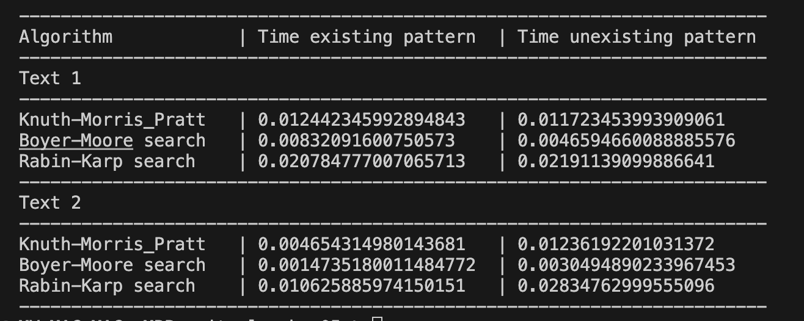

# goit-algo-hw-05

Comparison of search algorithms effectiveness

We have made comparison of search time of the three basic algorithms: Knuth-Morris_Pratt, Boyer-Moore and Rabin-Karp. They perform the search of a pattern string in the main text. The experiments were provided for two articles with existing and unexisting pattern strings.

# Text 1

We can see from results that Boyer-Moore search algorithm is the fastest one. The slowest is the Rabin-Karp search algorithm. Knuth-Moris is approximately 2 times faster in comparison with the last one, but still several times slower than Boyer-Moore one. We can notice that for almost all algorithms search time of the unexisting pattern is faster than of the existing one.

# Text 2

As in previous test, the Boyer-Moore search algorithm is the fastest one and the Rabin-Karp algorithm is the slowest one. But we can see here the difference for existing and unexisting patterns search time. In this case search time for the existing search pattern was faster than for the unexisting one for all algorithms.

# General conclusions

During experiments with search time for different patterns in two texts we have defined that the Boyer-Moore search algorithms is the fastest one. It effectiveness was in several time greater for all patterns than effectiveness of other search algorithms. The slowest is the Rabin-Karp search algorithm.
